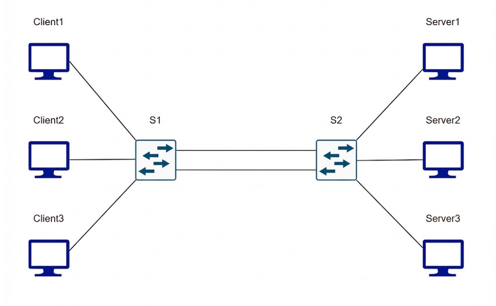
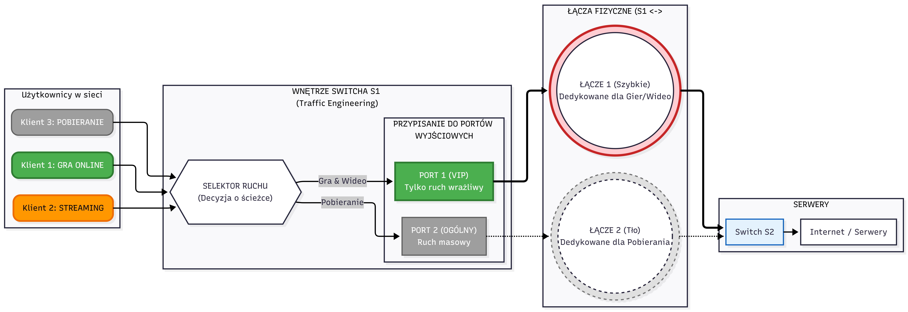

# Gwarancja Jakości (QoS) dla Gier i Streamingu Wideo w SDN

## Przegląd Projektu

Ten projekt implementuje mechanizm Quality of Service (QoS) w środowisku sieci programowalnej (SDN). Celem projektu jest zapewnienie niskich opóźnień i gwarantowanej przepustowości dla ruchu gier komputerowych przy jednoczesnym obsłużeniu ruchu wideo i pobierania plików. System dynamicznie dostosowuje pasmo dla strumieniowania wideo, gdy wykryty zostanie ruch generowany przez gry.

## Zasada Działania QoS

Algorytm zarządzania pasmem jest wykonywany w kontrolerze SDN i reaguje na zmiany w sieci w czasie rzeczywistym.

1. Pakiety przychodzące do przełącznika są klasyfikowane na podstawie nagłówków (porty, protokół) do jednej z trzech kategorii: **Gra**, **Wideo**, **Pobieranie**.
2. System monitoruje aktywne przepływy na łączu głównym o przepustowości **21 Mbps**.
3. Ruch typu **Gra** posiada najwyższy priorytet i ma zarezerwowane **5 Mbps** pasma.
4. Ruch typu **Wideo** domyślnie może wykorzystać do **20 Mbps**.
5. **Dynamiczne dławienie:** W momencie wykrycia aktywnego ruchu gry, przepustowość dla Wideo jest automatycznie ograniczana do **15 Mbps**, aby zwolnić zasoby dla gry.
6. Ruch typu **Pobieranie** jest obsługiwany w trybie "Best Effort" - wykorzystuje pozostałe wolne zasoby.

## Topologia Sieci

Topologia została zaprojektowana w Mininet i składa się z dwóch głównych przełączników połączonych dwoma łączami, obsługujących klientów i serwery.



Topologia składa się z następujących elementów:

* **Przełączniki (Switches):** S1, S2
* **Klienci (Clients):** Client1, Client2, Client3 (podłączeni do S1)
* **Serwery (Servers):** Server1, Server2, Server3 (podłączeni do S2)
* **Łącza między przełącznikami:** Dwa łącza fizyczne. Zarządzanie QoS odbywa się na głównym łączu transmisyjnym.

## Uruchomienie Topologii

Aby uruchomić emulację sieci w środowisku Mininet i podłączyć ją do zdalnego kontrolera, należy użyć poniższego polecenia:

```bash
sudo mn --custom topo.py --topo mytopo --controller=remote,ip=127.0.0.1,port=6653
```

### Mapowanie Ruchu
Klient losuje serwer oraz typ ruchu.



Aby uruchomić należy użyć poleceń:

```bash
sudo python generator.py --ip 10.0.0.4 --type GAME
sudo python generator.py --ip 10.0.0.4 --type VIDEO
```

## Przypisanie kolejek
Aby przypisać kolejki należy użyć poleceń:

```bash

sudo ovs-vsctl set Port s1-eth4 qos=@newqos  -- --id=@newqos create QoS type=linux-htb other-config:max-rate=20000000 queues=0=@q0,1=@q1,2=@q2  -- --id=@q0 create Queue other-config:min-rate=20000000 other-config:max-rate=20000000  -- --id=@q1 create Queue other-config:min-rate=5000000 other-config:max-rate=20000000  -- --id=@q2 create Queue other-config:min-rate=5000000 other-config:max-rate=15000000

sudo ovs-vsctl set port s1-eth5 qos=@newqos -- --id=@newqos create qos type=linux-htb other-config:max-rate=1000000 queues=0=@q0 -- --id=@q0 create queue other-config:min-rate=1000000 other-config:max-rate=1000000
```
Następnie, żeby sprawdzić przypisanie:
```bash
sudo ovs-ofctl queue-stats s1
```
## Autorzy:
* Paweł Oleszczak
* Sebastian Gawlak
* Gabriel Kraj
* Kacper Janicki

